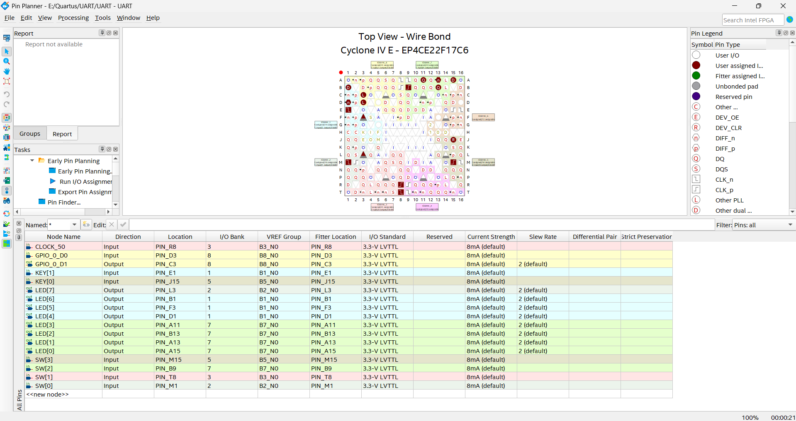

# DE0-Nano UART Transceiver

[](https://en.wikipedia.org/wiki/Verilog)
[](https://www.intel.com/content/www/us/en/products/details/fpga/cyclone/iv.html)
[](https://www.terasic.com.tw/cgi-bin/page/archive.pl?Language=English&CategoryNo=139&No=593)
[]()
[]()

## Overview

A modular UART transceiver implementation in Verilog HDL for the DE0-Nano FPGA board (Cyclone IV E, EP4CE22F17C6N). This project provides a complete 8-bit UART communication system with both hardware and simulation verification.

## Project Contents

- **uart_tx.v** - UART transmitter module
- **uart_rx.v** - UART receiver module
- **uart_transceiver.v** - Combined transceiver wrapper
- **uart_top.v** - DE0-Nano top-level module
- **tb_uart_transceiver.v** - Simulation testbench
- **UART.qpf** / **UART.qsf** - Quartus project files

## Features

- 8-bit UART communication
- 8N1 protocol format:
  - 1 start bit
  - 8 data bits (LSB first)
  - No parity bit
  - 1 stop bit
- Parameterized baud rate configuration
- Loopback hardware verification on DE0-Nano
- Functional simulation testbench
- Real-time LED feedback on DE0-Nano board

## Hardware Specifications

| Parameter | Value |
|-----------|-------|
| Board | DE0-Nano |
| FPGA Family | Cyclone IV E |
| Device Part Number | EP4CE22F17C6N |
| System Clock | 50 MHz |
| Baud Rate | 9600 bps |
| Clock Cycles per Bit | 5208 |

Baud rate calculation:
```
CLKS_PER_BIT = 50,000,000 Hz / 9600 bps ≈ 5208 cycles per bit
```

## File Structure

```
.
├── uart_tx.v                  # UART transmitter FSM
├── uart_rx.v                  # UART receiver FSM
├── uart_transceiver.v         # Transceiver wrapper
├── uart_top.v                 # DE0-Nano top module
├── tb_uart_transceiver.v      # Simulation testbench
├── UART.qpf                   # Quartus project file
├── UART.qsf                   # Quartus settings file
├── .gitignore                 # Git ignore rules
└── README.md                  # This file
```

## Module Architecture

### uart_tx.v

UART transmitter implementing a finite state machine.

**Functionality:**
- Monitors transmit request signal
- Sends start bit (logic 0)
- Transmits 8 data bits (LSB first)
- Sends stop bit (logic 1)
- Asserts done flag upon completion
- Configurable baud rate via CLKS_PER_BIT parameter

### uart_rx.v

UART receiver implementing a finite state machine.

**Functionality:**
- Detects start bit transition
- Samples incoming data at optimal timing points
- Reconstructs 8-bit received byte
- Asserts data-valid flag upon frame completion
- Configurable baud rate via CLKS_PER_BIT parameter

### uart_transceiver.v

Wrapper module combining transmitter and receiver.

**Purpose:** Simplifies instantiation of complete UART functionality in top-level designs.

### uart_top.v

Top-level module for DE0-Nano board integration.

**Features:**
- System reset via KEY[0]
- Transmit trigger via KEY[1]
- Transmits fixed test byte (0xA5)
- Loopback reception capability
- Received byte displayed on onboard LEDs

### tb_uart_transceiver.v

Comprehensive simulation testbench for functional verification.

**Verification approach:**
- 50 MHz clock generation
- System reset sequencing
- Loopback UART transmission and reception
- Received byte validation

## Hardware Verification

### Loopback Configuration

The hardware verification uses internal loopback on the DE0-Nano.

**Loopback wiring:**
- Connect GPIO_0_D1 (TX) to GPIO_0_D0 (RX)
- Physical connection: JP1 pin 4 to JP1 pin 2 on GPIO header

**Procedure:**
1. Press KEY[0] to reset the system
2. Press KEY[1] to initiate transmission
3. UART transmitter sends byte 0xA5 (10100101 binary)
4. Loopback wire routes transmitted data to receiver
5. Received byte is latched and displayed on LEDs

**Expected LED Output:**
```
LED[7] = 1 (ON)
LED[6] = 0 (OFF)
LED[5] = 1 (ON)
LED[4] = 0 (OFF)
LED[3] = 0 (OFF)
LED[2] = 1 (ON)
LED[1] = 0 (OFF)
LED[0] = 1 (ON)
```

## Pin Assignments (DE0-Nano)

### Clock and Control
| Signal | Pin |
|--------|-----|
| CLOCK_50 | R8 |
| KEY[0] (Reset) | J15 |
| KEY[1] (Send) | E1 |

### LEDs
| Signal | Pin |
|--------|-----|
| LED[0] | A15 |
| LED[1] | A13 |
| LED[2] | B13 |
| LED[3] | A11 |
| LED[4] | D1 |
| LED[5] | F3 |
| LED[6] | B1 |
| LED[7] | L3 |

### UART GPIO
| Signal | Pin |
|--------|-----|
| GPIO_0_D0 (RX) | D3 |
| GPIO_0_D1 (TX) | C3 |

### Pin Planner Reference

The following image shows the Quartus Pin Planner view with all assigned pins for the DE0-Nano device (Cyclone IV E - EP4CE22F17C6N):



This visualization displays:
- Clock and control input pins (CLOCK_50, KEY[0], KEY[1])
- LED output pins (LED[0] through LED[7])
- UART GPIO pins for serial communication (GPIO_0_D0, GPIO_0_D1)
- Wire bond diagram showing physical pin locations on the Cyclone IV E package

## Operation Flow

1. **Initialization:** System boots with KEY[0] active (reset)
2. **Idle State:** Awaiting KEY[1] press
3. **Transmission:** KEY[1] triggers UART transmitter to send 0xA5
4. **Reception:** Loopback wire feeds transmitted data to receiver
5. **Display:** Received byte is latched to LEDs, showing bit pattern of 0xA5

## Simulation

### Testbench Execution

The testbench (`tb_uart_transceiver.v`) performs the following:

1. Generates 50 MHz system clock
2. Applies power-on reset sequence
3. Issues transmit request for test byte
4. Internally loops TX output to RX input
5. Waits for reception to complete
6. Verifies received byte matches transmitted value

### Running Simulation in ModelSim/Questa

```bash
vlog uart_tx.v uart_rx.v uart_transceiver.v tb_uart_transceiver.v
vsim tb_uart_transceiver
run -all
```

## Implementation in Quartus

### Project Setup

1. Launch Quartus Prime
2. Create new project with following settings:
   - Family: Cyclone IV E
   - Device: EP4CE22F17C6N

### Design Files

3. Add design files to project:
   - uart_tx.v
   - uart_rx.v
   - uart_transceiver.v
   - uart_top.v

### Configuration

4. Set top-level entity: `uart_top`
5. Open Pin Planner and assign pins according to [Pin Assignments](#pin-assignments-de0-nano) section
6. Verify UART GPIO pin assignments match loopback configuration

### Compilation and Programming

7. Compile design:
   - Processing → Start Compilation (or Ctrl+L)
8. Program FPGA:
   - Tools → Programmer
   - Select USB-Blaster device
   - Program SRAM

### Hardware Testing

9. Establish loopback connection:
   - Connect JP1 pin 4 to JP1 pin 2 on GPIO header
10. Press KEY[1] on board
11. Observe LED pattern on board (should display 10100101 binary)

## Expected Results

| Test Case | Input | Expected Output |
|-----------|-------|-----------------|
| Loopback Transmission | 0xA5 | LEDs display 10100101 |
| Simulation | 0xA5 | Received byte = 0xA5 |

## Future Enhancements

Potential extensions to this baseline implementation:

- Switch-controlled data transmission (transmit different bytes)
- Multi-board UART communication
- External 7-segment display interface
- Parity and error detection mechanisms
- Configurable baud rate selection
- PC host communication via USB-UART bridge
- FIFO buffering for multiple frames
- Hardware flow control (RTS/CTS)

## Implementation Notes

- Current design uses fixed test byte (0xA5) for straightforward verification
- Receiver implementation prioritizes clarity and educational value
- DE0-Nano board lacks onboard 7-segment displays; external hardware required for alternative output
- UART protocol is industry-standard, enabling compatibility with external devices via USB adapters

## Design Verification Status

- Simulation: Verified
- Hardware (Loopback): Verified on DE0-Nano
- Timing: Verified for 50 MHz operation
- Baud Rate Accuracy: 9600 bps at 50 MHz

## License

This project is provided for educational and development purposes.

## References

- Terasic DE0-Nano Documentation: [www.terasic.com.tw](https://www.terasic.com.tw/cgi-bin/page/archive.pl?Language=English&CategoryNo=139&No=593)
- Intel Cyclone IV Device Documentation
- UART Protocol Specification